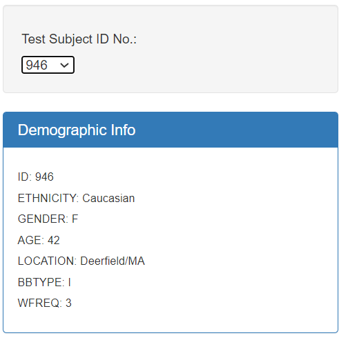
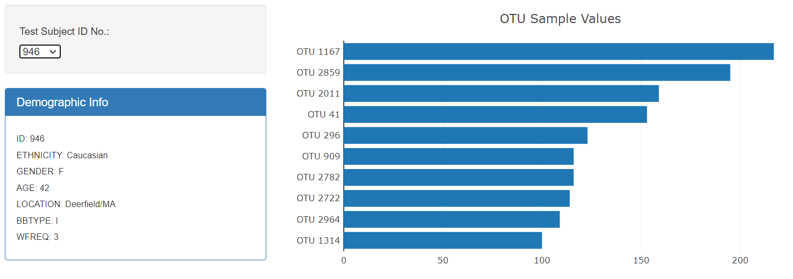

# Plotly Visualizations

## Background

An interactive dashboard built to explore a .json file, identifying the biodiversity among microbes that colonize human navels.  The dataset reveals that a small handful of microbial species (also called operational taxonomic units, or OTUs, in the study) were present in more than 70% of people, while the rest were relatively rare.

The D3, JavaScript library was used to read and visualize multiple arrays of data sourced through a .json file and interactively displayed in an .html file.  Value variables were created and inserted into plotly coding to build a bar and bubble chart.

### Interactive Dropdown Menu and Data Panel

An html dropdown menu was developed to hold a list of Subject IDs and responsively adjust chart values upon selection.  A separate data array was read to pull the selected patient's demographic information and rendered into an html div tag.

 
### Bar Chart

Visualized data was sorted and sliced in JavaScript coding to sort values in descending order and solely display the top 10 OTUs found for a specific Subject ID.  Hover text was added to bars to provide the otu_labels.  Chart layout coding was used to add a title and set the size of the chart.  Lastly, all bar chart data was rendered into a correlated div tag in the .html file to be displayed in the localhost. 

### Bubble Chart

Chart values variables used to establish X & Y values (x: otu_ids, y: sample_values).  Sample value totals reflected in size and otu_ids marked by color.  Otu_labels added as hover text.  All Bar Chart data again rendered into a correlated div tag in the .html file to be displayed in the localhost.

